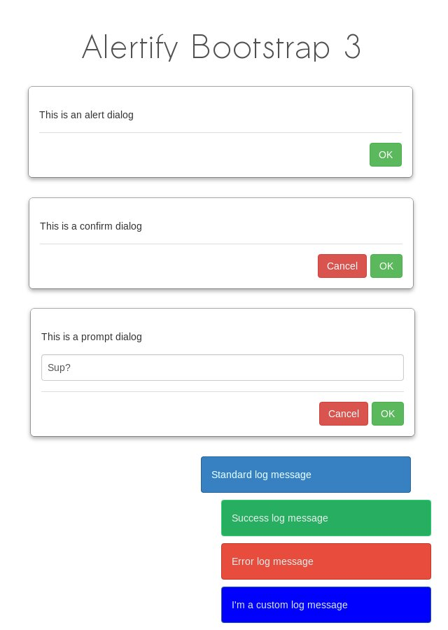

alertify.js Bootstrap 3 Theme 
=============================

Bootsrap 3 look & feel for your notifications. See it [in action](http://dbtek.github.io/alertify-bootstrap-3).

## Install
- via bower (recommended, installs alertify also as a dependency)  
```bower install alertify-bootstrap-3```
  
- via git  
```git clone https://github.com/dbtek/alertify-bootstrap-3.git```




## Usage
- Inlcude core and theme css  

```html
  <!-- Alertify core css -->
  <link rel="stylesheet" href="alertify/themes/alertify.core.css" />
  <!-- Bootstrap 3 theme -->
  <link rel="stylesheet" href="alertify-bootstrap-3/alertify.bootstrap3.css" />
```
- Use it.

## Credits
- [alertify.js](fabien-d.github.io/alertify.js/)

## License
- MIT
